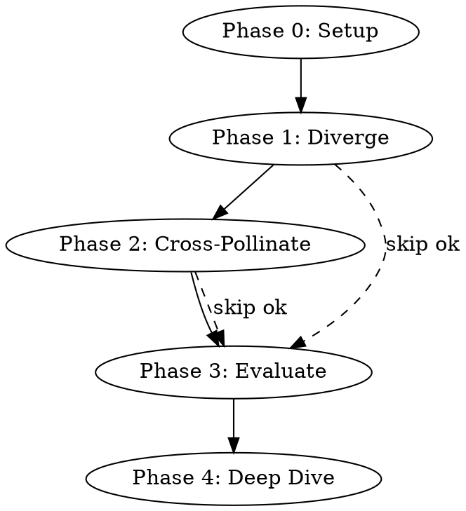

# Multi-Perspective Ideation

Generate ideas through 8 expert personas, cross-pollinate them, evaluate systematically, and deep-dive into the most promising ones.

## Workflow



Each phase can be skipped if the user requests it. Always confirm before proceeding to the next phase.

## Phase 0: Setup

1. Confirm the **theme** (what to ideate about)
2. Ask 1-2 questions about **context and constraints** (target audience, budget, timeline, domain, etc.) — keep it brief
3. Confirm **personas**: default 8 experts, or ask if the user wants to add/replace any
   - Default 8: Creative Expert, Technical Expert, Business Expert, Academic Researcher, Social Scientist, Disruptor, Humorist, Adventurer
   - For custom personas, see `references/personas.md` for creation guidelines

**Output language:** Match the user's input language.

## Phase 1: Diverge

Each expert generates **2-3 ideas** (total 16-24 ideas).

**Output format per expert:**

```
### 🎨 Creative Expert (or relevant emoji per persona)

1. **[Idea Name]** — [1-2 sentence description]
   💡 Why this persona suggests it: [1 sentence reasoning]

2. **[Idea Name]** — [1-2 sentence description]
   💡 Why this persona suggests it: [1 sentence reasoning]
```

**Persona detail:** Read `references/personas.md` for each persona's thinking style, lens, and typical angles. Use these to ensure ideas genuinely differ across personas — not generic ideas with different labels.

**Quality gate:** Each idea must be specific and actionable, not abstract platitudes. "Use AI" is bad. "Build an AI that analyzes customer complaints to auto-generate product improvement tickets" is good.

After output, ask the user: "Phase 2（融合）に進みますか？ それともこの中から気になるアイデアはありますか？"

## Phase 2: Cross-Pollinate

Combine ideas from **different** personas to create **5-8 hybrid ideas**.

**Output format:**

```
### Hybrid Ideas

1. **[Hybrid Idea Name]**
   - 🔀 Source: [Persona A] "#[idea number]" × [Persona B] "#[idea number]"
   - 💡 Fusion insight: [What combining these two perspectives reveals]
   - 📝 Description: [2-3 sentences]

2. ...
```

**Selection criteria for combinations:**
- Prioritize unexpected pairings (e.g., Humorist × Academic, Disruptor × Business)
- Each hybrid must produce something neither source idea alone would suggest
- Avoid trivial merges ("just do both")

After output, ask the user: "Phase 3（評価）に進みますか？ 評価軸をカスタマイズしたい場合はお知らせください。"

## Phase 3: Evaluate

Score **all ideas** (Phase 1 + Phase 2) on a matrix.

**Default evaluation axes (1-5 scale):**

| Axis | 1 | 5 |
|------|---|---|
| Feasibility (実現可能性) | Requires breakthrough tech / massive investment | Can start tomorrow with existing resources |
| Impact (インパクト) | Marginal improvement | Game-changing potential |
| Novelty (新規性) | Already commonly done | No one has tried this |
| Cost Efficiency (コスト効率) | Extremely expensive | Very low cost relative to value |

If the user specified custom axes in Phase 0 or here, use those instead.

**Output format:**

```
## Evaluation Matrix

| # | Idea | Source | Feas. | Impact | Novel | Cost Eff. | Total |
|---|------|--------|-------|--------|-------|-----------|-------|
| 1 | [name] | Creative #1 | 4 | 5 | 3 | 4 | 16 |
| 2 | [name] | Hybrid #3 | 3 | 4 | 5 | 3 | 15 |
| ... |

### 🏆 Top Ideas

1. **[#1 Idea Name]** (Total: XX) — [1 sentence on why it ranks high]
2. **[#2 Idea Name]** (Total: XX) — [1 sentence]
3. **[#3 Idea Name]** (Total: XX) — [1 sentence]
```

Sort by total score descending. Highlight top 3-5 as "注目アイデア".

After output, ask: "どのアイデアを深掘りしますか？ 番号で1〜3個選んでください。"

## Phase 4: Deep Dive

For each selected idea (1-3), produce a structured mini-proposal:

```
## Deep Dive: [Idea Name]

### Overview
[1 paragraph description — what it is and why it matters]

### Target
[Who benefits and why they care]

### Implementation Steps
1. [Concrete step 1]
2. [Concrete step 2]
3. [Concrete step 3]
(3-5 steps)

### Risks & Mitigations
| Risk | Mitigation |
|------|-----------|
| [risk 1] | [mitigation] |
| [risk 2] | [mitigation] |

### Success Metrics
- [Metric 1]: [Target]
- [Metric 2]: [Target]

### First Action
🚀 [The one thing to do tomorrow to start moving]

### SNS展開ブリーフ
- **コンセプト一言**: [競合と差別化した発信軸を1文で]
- **ターゲット**: [年齢・職業・状況を具体的に]
- **推奨プラットフォーム**: [X / Instagram / TikTok / note / YouTube]
- **SNS目的**: [認知拡大 / 集客 / 販売 / ブランディング]
- **差別化の軸**: [競合と何が違うか1文で]
```

After output, ask: "他にも深掘りしたいアイデアはありますか？ /sns-research でこのブリーフをもとにSNS市場調査を続けることもできます。"

## Quick Reference

| Phase | Input | Output | Skip? |
|-------|-------|--------|-------|
| 0 Setup | Theme + context | Confirmed scope & personas | No |
| 1 Diverge | Theme | 16-24 ideas (8 personas × 2-3) | No |
| 2 Cross-Pollinate | Phase 1 ideas | 5-8 hybrid ideas | Yes |
| 3 Evaluate | All ideas | Scored matrix + top 3-5 | Yes |
| 4 Deep Dive | User picks 1-3 | Mini-proposals with action plans | Yes |
